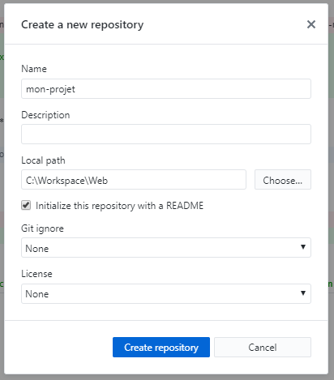
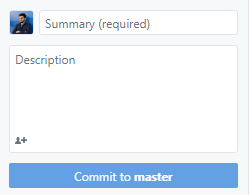
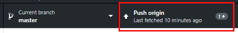

>_***Git*** est un outil qui nous permet d’avoir un historique de toutes les modifications que l’on a faites dans un projet sur une timeline, c'est le ***versioning***. Un projet géré via git s'appelle un ***repository*** ou ***repo***._

>_***GitHub*** est un service en ligne qui permet d'héberger ses ***repositories*** de code._
## Installation :hammer_and_wrench:
- Téléchargez et installez [Git](https://git-scm.com/download).
- Créez votre compte sur [Github](https://github.com/).
- Téléchargez le logiciel [Github Desktop](https://desktop.github.com/), installez le et connectez vous avec votre compte Github.

## Création du repo :construction:
- Dans **Github Desktop**, créez un **New repository**. 
>Par convention de nommage, on va utiliser le "kebab-case" (exemple: "tout-en-minuscule-avec-petits-tirets"). 


- On n'oublie pas sa petite **description** qui va bien.
- Choisissez un répertoire pour votre projet dans **Local path**.
- Cochez Initialize this repository with a **README**.
> Le ficher *README* sert à documenter votre projet de manière détaillée (le texte que tu lis est un README :astonished:)
- Puis cliquez sur **Create repository**.

Ouvrez maintenant votre nouveau projet depuis votre **IDE**.

## Arborescence du projet :deciduous_tree:
- Créez l'arborescence de fichiers de votre projet.
```
/mon-projet
    ├──/css
    |    └── style.css
    ├──/images 
    |    └── ...
    ├──/js 
    |    └── main.js
    ├── .gitignore
    ├── index.html
    └── README.md
```
>_Le fichier ***.gitignore*** sert à exclure des fichiers et/ou dossiers des modifications à envoyer au repo. Par exemple, exclure des fichiers générés par l'IDE ou des fichiers contenant des données sensibles (authentification à une base de données par exemple)._

Vous avez maintenant des modifications en cours que vous pouvez visualiser dans **Github Desktop**. Nous allons maintenant enregistrer tout ça sur Github !

## Commit - Push sur la branche "master" :rocket:
>_***Commit :*** valide les modifications du projet à un instant T, lorsqu’il y a plusieurs commits, vous pouvez les comparer et ainsi observer les changements apportés au projet._
>
>_***Push :*** envoie les commits au repo distant._
>
>_***Branche :*** timeline contenant de l'historique des modifcations du projet._
>
>_***master :*** la branche master est la branche par défaut qui contient le code courant de votre projet._
- Dans **Github Desktop**, regardez en bas à gauche de l'interface :


- Remplissez le champ **Summary** en décrivant succintement les modifications en cours _(ex: "création arborescence")_.
- Si vous le souhaitez, vous pouvez ajouter plus d'informations dans le champ **Description**.
- Cliquez ensuite sur **Commit to master**.

Maintenant que le commit est effectué, les modifications ont donc été bien validées et vous n'avez plus de modifications en cours. Il ne reste plus qu'à envoyer ces modifications sur le repo Github.

- Toujours dans Github Desktop, en haut de l'interface :


- Cliquez sur **Push origin**, et le tour est joué !

>_***origin :*** le nom par défaut que Git donne au serveur._

>Ces étapes seront à renouveler aux points clés de votre avancement du projet, **il ne faut pas hésiter à commit vos modification régulièrement**, c'est ce qui va constituer l'historique de vos modifications. 

>Vous pouvez accumuler plusieurs commits avant de push sur le repo Github.


### Il ne vous reste plus qu'à coder :art:
